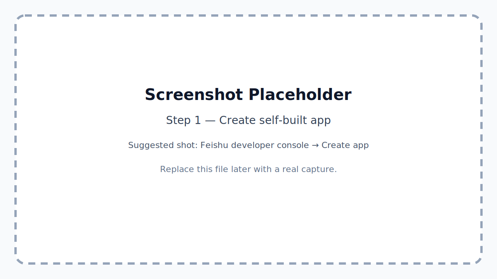
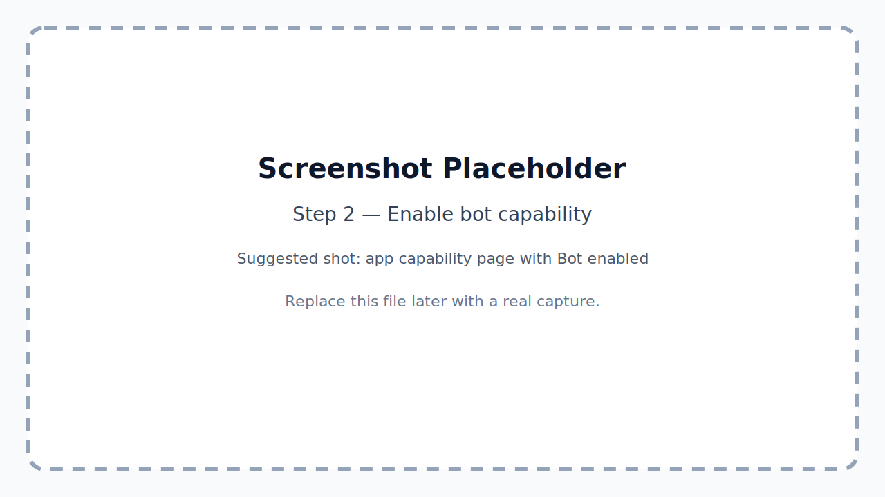
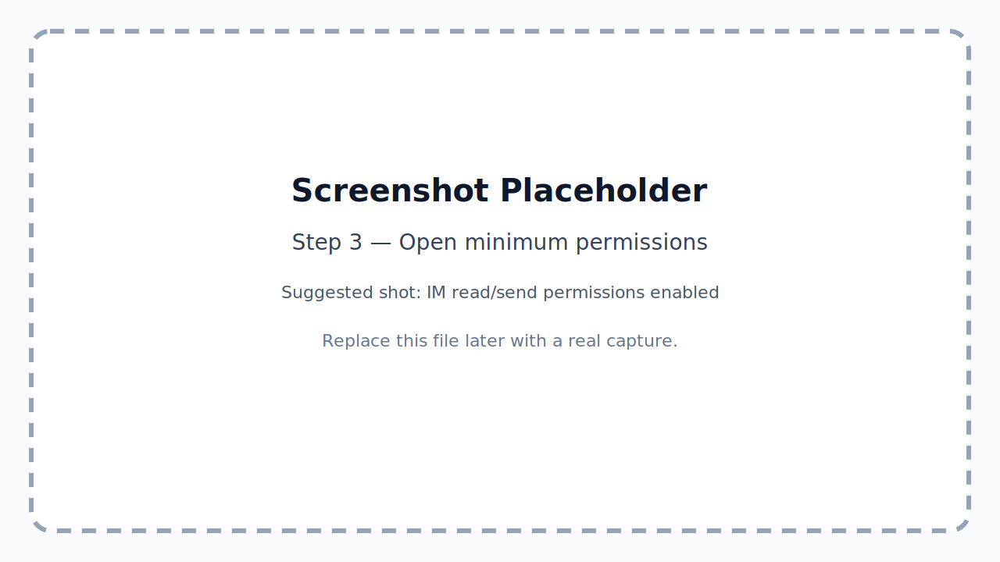
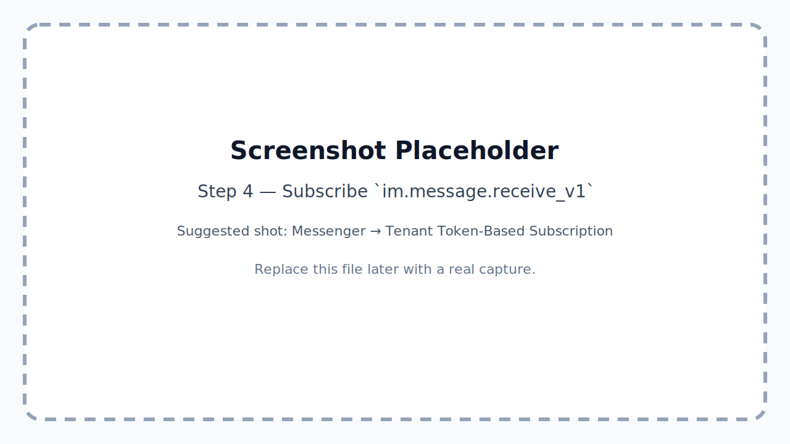
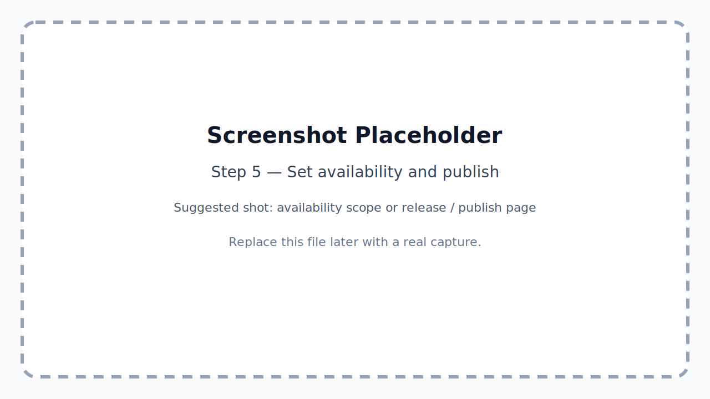
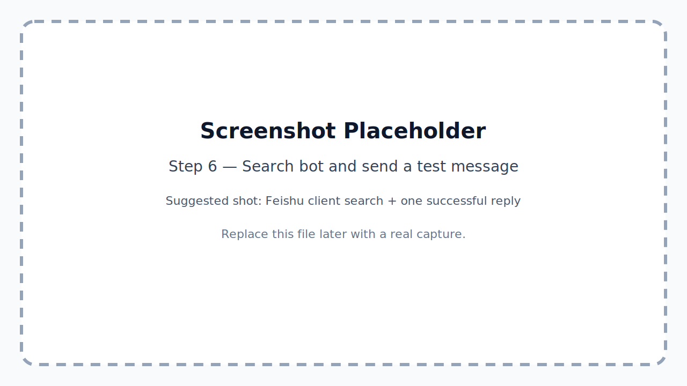

# Feishu Bot Setup Guide

> This is the shareable setup guide for getting a RemoteLab-backed Feishu bot live without first reading the internal research notes.
>
> Steps marked **[HUMAN]** require Feishu console or chat-client access. Steps marked **[LOCAL OPERATOR]** happen on the machine running RemoteLab.

---

## What this guide gives you

By the end of this flow you should have:

- one **self-built Feishu app bot**
- one subscribed inbound event: **`im.message.receive_v1`**
- one local `feishu-connector` process connected through **persistent connection**
- one working **private-chat** validation path
- screenshot placeholders you can replace later with real captures

This guide is intentionally optimized for the fastest working path:

- **self-built app bot**, not a custom group webhook bot
- **same-tenant rollout first**, not cross-tenant distribution
- **private chat first**, group support later
- **persistent connection / long connection**, not public webhook mode

---

## Prerequisites

Before you start, make sure:

- RemoteLab is already installed on the target machine and the main chat server is running on `http://127.0.0.1:7690`
- the repo at `~/code/remotelab` already ran `npm install`
- the operator has one Feishu developer account that can create a self-built app
- the first validation user is inside the **same Feishu tenant** as the app
- the target machine already has the intended AI CLI tool installed (this guide assumes `codex`)

---

## Fast path

If you only need the short version, the working sequence is:

1. **[HUMAN]** Create a self-built Feishu app.
2. **[HUMAN]** Enable the app's bot capability.
3. **[HUMAN]** Open the minimum read/send IM permissions.
4. **[HUMAN]** Subscribe only **`im.message.receive_v1`** under **Tenant Token-Based Subscription**.
5. **[HUMAN]** Add the tester into app availability scope and publish/apply the current version.
6. **[HUMAN]** Send the operator `App ID`, `App Secret`, region, and confirmation that the bot is searchable.
7. **[LOCAL OPERATOR]** Create `~/.config/remotelab/feishu-connector/config.json`.
8. **[LOCAL OPERATOR]** Start the connector with `npm run feishu:connect:instance`.
9. **[HUMAN]** Return to the Feishu console if needed, save persistent connection mode, then send the bot a private message.
10. **[LOCAL OPERATOR]** Verify inbound events and outbound reply with `npm run feishu:check -- --watch 15`.

The detailed version below is the safer handoff path.

---

## 1. **[HUMAN]** Create a self-built app

Open the Feishu developer console and create a **self-built app**.

Recommendations:

- use a dedicated bot name that coworkers can search for later
- use a **test version / test tenant** first if your Feishu setup offers that flow
- do not use a custom group webhook bot for this connector



**Suggested real screenshot later:** the “Create app” page with the self-built app option selected.

---

## 2. **[HUMAN]** Enable bot capability

Inside the new app:

- enable the app's **bot** capability
- keep the first validation scope narrow
- start with private chat support before adding more surfaces



**Suggested real screenshot later:** the capability page showing Bot enabled.

---

## 3. **[HUMAN]** Open the minimum permissions

For V0, open only the minimum message permissions needed to read inbound private messages and send replies back as the app/bot.

At minimum, make sure the app can:

- read user-to-bot private messages
- send IM messages as the app / bot

Important note:

- if inbound starts working but outbound send later fails with Feishu error **`99991672`**, enable the exact IM send scope named in the error, such as `im:message:send`, `im:message`, or `im:message:send_as_bot`



**Suggested real screenshot later:** the permission page with the IM read/send scopes enabled.

---

## 4. **[HUMAN]** Subscribe the single V0 event

For the first end-to-end validation, add **only one event**:

- category: **Messenger**
- subscription type: **Tenant Token-Based Subscription**
- event label in the console: **Receive message v2.0** / **接收消息 v2.0**
- event key: **`im.message.receive_v1`**

Do **not** start by enabling a large batch of events.

Also choose **persistent connection / long connection** as the inbound mode.

Important order note:

- if the console warns **“No connection detected”**, that usually means the local connector is not online yet
- in that case, finish the rest of the console setup, let the local operator start the connector, then come back and save the persistent-connection mode again



**Suggested real screenshot later:** the event-subscription page showing `im.message.receive_v1` under Messenger.

---

## 5. **[HUMAN]** Set availability scope and publish/apply

Make sure the first tester can actually find the bot.

For V0:

- add your own Feishu account to the app's **availability scope**
- if one or two coworkers are joining the first validation, add them too
- publish / apply the current app version if the console requires it before the bot becomes searchable

Availability rule to remember:

- **same tenant**: expand availability scope and publish/apply
- **different tenant**: a self-built app is not enough; you need marketplace / distributable app flow later



**Suggested real screenshot later:** the availability-scope page or release page showing the tester scope.

---

## 6. **[HUMAN]** Send this handoff payload to the operator

When the console setup above is done, send this filled template:

```text
Feishu bot setup ready.

App ID: ...
App Secret: ...
Region: Feishu CN / Lark Global
Subscribed event: im.message.receive_v1
My user is in app availability scope: yes / no
I can already search the bot in Feishu: yes / no
```

That is enough for the local operator to wire up the connector.

---

## 7. **[LOCAL OPERATOR]** Create the connector config file

On the RemoteLab machine:

```bash
mkdir -p ~/.config/remotelab/feishu-connector

cat > ~/.config/remotelab/feishu-connector/config.json <<'EOF'
{
  "appId": "cli_xxx",
  "appSecret": "replace-with-real-secret",
  "region": "feishu-cn",
  "loggerLevel": "info",
  "chatBaseUrl": "http://127.0.0.1:7690",
  "sessionTool": "codex",
  "intakePolicy": {
    "mode": "allow_all"
  }
}
EOF
```

Notes:

- use `feishu-cn` for `open.feishu.cn`
- use `lark-global` for `open.larksuite.com`
- omit `sessionFolder` to use the operator's home directory by default
- `allow_all` is the simplest V0 mode; after the first validation you can switch to `whitelist`
- if you want a different tool, change `sessionTool` to the installed tool name RemoteLab supports

---

## 8. **[LOCAL OPERATOR]** Start the connector

From the repo root:

```bash
cd ~/code/remotelab
npm run feishu:connect:instance
```

Useful companion commands:

```bash
npm run feishu:check -- --watch 15
./scripts/feishu-connector-instance.sh status
./scripts/feishu-connector-instance.sh logs
tail -f ~/.config/remotelab/feishu-connector/connector.log
```

Expected signs of success:

- the instance helper prints that the connector started
- the log contains `persistent connection ready`
- `feishu:check` shows new inbound events once the human sends a message

If the Feishu console previously complained about **no persistent connection**, now is the time for the human to go back and save the event mode again.

---

## 9. **[HUMAN]** Validate private chat end to end

In the Feishu client:

- search for the bot by name
- open a private chat with it
- send a short test message such as `ping` or `介绍一下你是谁`

Expected result:

- the connector receives the message
- RemoteLab creates or reuses the matching session
- the bot replies back into Feishu



**Suggested real screenshot later:** the Feishu chat window with the bot visible in search and one successful reply.

---

## 10. Quick troubleshooting

### The console says “No connection detected”

- start the local connector first
- wait until the log shows `persistent connection ready`
- go back to the Feishu console and save persistent connection mode again

### Inbound works but the bot never replies

- inspect the connector log for Feishu API error **`99991672`**
- if present, enable the exact outbound IM send scope Feishu names in the error
- the common fix is one of `im:message:send`, `im:message`, or `im:message:send_as_bot`

### Coworkers cannot search the bot

- expand the app's availability scope to those users / departments / the full tenant
- publish / apply the version they are using
- remember that **self-built apps are same-tenant only**

### You want staged rollout instead of open access

- switch the connector from `allow_all` to `whitelist`
- the connector can re-read `allowed-senders.json` on each inbound message, so small allowlist changes do not require restart

---

## 11. What to do after private chat works

Once private chat is stable, the next rollout steps are:

1. widen the same-tenant availability scope
2. validate that another coworker can search the bot
3. validate that the bot can be added to a normal group
4. optionally enable connector-level whitelist controls
5. only then consider group auto-approval or cross-tenant distribution

If you want group-based auto-approval later, also subscribe to:

- `im.chat.member.user.added_v1`

That is **not required** for the first V0 rollout.

---

## Replacing the screenshot placeholders later

This guide intentionally includes placeholder images under `docs/assets/feishu-bot/`.

You can replace them later in either of these ways:

- keep the same filenames and overwrite the placeholder files with real captures
- or update the Markdown image links in this document to point at your real screenshots

Recommended capture points:

- create self-built app
- enable bot capability
- open IM permissions
- subscribe `im.message.receive_v1`
- set availability scope / publish
- show one successful Feishu private-chat reply

---

## Related internal docs

If you need deeper implementation or rollout context after the setup is working:

- `notes/feishu-bot-connector.md`
- `notes/feishu-bot-operator-checklist.md`
- `notes/feishu-bot-setup-lessons.md`
- `docs/external-message-protocol.md`
